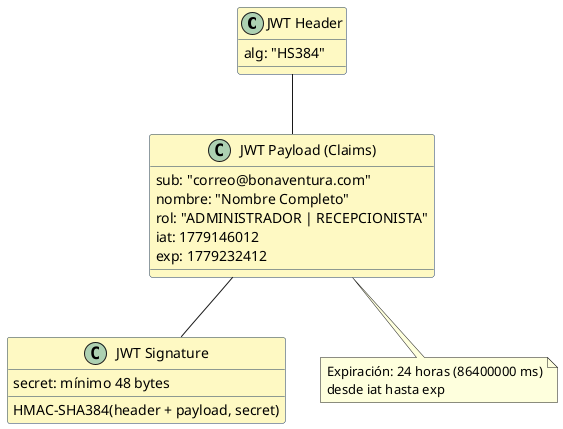
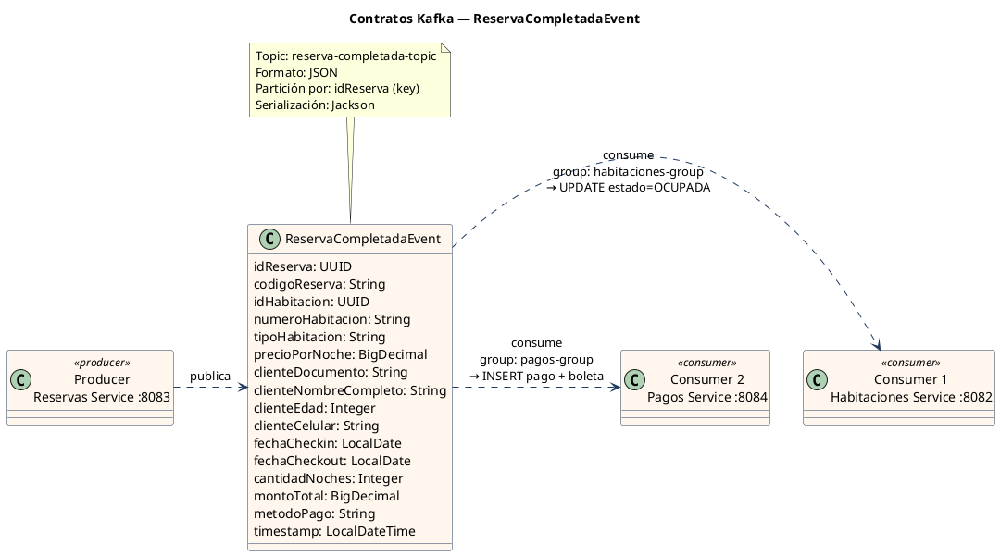
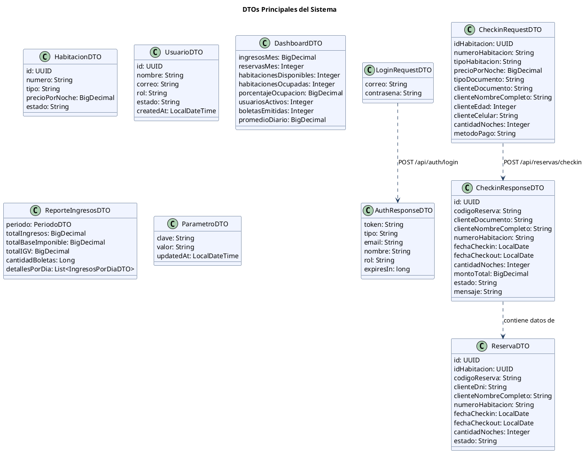

# Contratos de Servicios — Hotel BonAventura

Especificación formal de todos los endpoints REST y eventos Kafka del sistema.
Incluye URL, método, headers, request body, response body y códigos de estado.

---

## Tabla de Contenidos

1. [Hotel Gateway — Rutas y Seguridad](#1-hotel-gateway--rutas-y-seguridad)
2. [Auth Service — /api/auth](#2-auth-service--apiauth)
3. [Habitaciones Service — /api/habitaciones](#3-habitaciones-service--apihabitaciones)
4. [Reservas Service — /api/reservas](#4-reservas-service--apireservas)
5. [Pagos Service — /api/pagos](#5-pagos-service--apipagos)
6. [Administración Service — /api/admin](#6-administración-service--apiadmin)
7. [Contratos Kafka — Eventos Asíncronos](#7-contratos-kafka--eventos-asíncronos)
8. [Diagrama de DTOs Principales](#8-diagrama-de-dtos-principales)

---

## 1. Hotel Gateway — Rutas y Seguridad

**Base URL:** `http://localhost:8080`
**Puerto:** 8080 | **Stack:** Spring Cloud Gateway (WebFlux)

### Tabla de Enrutamiento

| Prefijo URL | Destino | Auth requerida | Roles permitidos |
|---|---|---|---|
| `/api/auth/**` | Auth Service :8081 | No (pública) | Todos |
| `/api/habitaciones/**` | Habitaciones Service :8082 | JWT Bearer | ADMINISTRADOR, RECEPCIONISTA |
| `/api/reservas/**` | Reservas Service :8083 | JWT Bearer | ADMINISTRADOR, RECEPCIONISTA |
| `/api/pagos/**` | Pagos Service :8084 | JWT Bearer | ADMINISTRADOR, RECEPCIONISTA |
| `/api/admin/**` | Administración Service :8085 | JWT Bearer | ADMINISTRADOR |
| `/actuator/health` | Gateway interno | No | Todos |

### Headers Inyectados por el Gateway

Cuando el JWT es válido, el Gateway añade estos headers antes de reenviar:

| Header | Valor | Origen |
|---|---|---|
| `X-User-Email` | Email del usuario autenticado | Claim `sub` del JWT |
| `X-User-Role` | Rol del usuario | Claim `rol` del JWT |

### Estructura del JWT



---

## 2. Auth Service — /api/auth

**Base URL:** `http://localhost:8081/api/auth`
**Puerto:** 8081 | **Stack:** Spring Boot 4 + Spring Security + JJWT 0.12.6

---

### POST /api/auth/login

Autentica un usuario y retorna un JWT firmado.

**Autenticación:** No requerida (ruta pública)

#### Request

```http
POST http://localhost:8080/api/auth/login
Content-Type: application/json
```

```json
{
  "correo": "admin@bonaventura.com",
  "contrasena": "admin2026"
}
```

| Campo | Tipo | Validaciones |
|---|---|---|
| `correo` | String | `@NotBlank`, `@Email` |
| `contrasena` | String | `@NotBlank` |

#### Responses

**200 OK — Login exitoso**
```json
{
  "token": "eyJhbGciOiJIUzM4NCJ9...",
  "tipo": "Bearer",
  "email": "admin@bonaventura.com",
  "nombre": "Renzo Administrador",
  "rol": "ADMINISTRADOR",
  "expiresIn": 86400000
}
```

**400 Bad Request — Validación fallida**
```json
{
  "timestamp": "2026-05-22T10:30:00",
  "status": 400,
  "error": "Bad Request",
  "message": "Formato de correo invalido",
  "path": "/api/auth/login"
}
```

**401 Unauthorized — Credenciales incorrectas**
```json
{
  "timestamp": "2026-05-22T10:30:00",
  "status": 401,
  "error": "Unauthorized",
  "message": "Credenciales invalidas",
  "path": "/api/auth/login"
}
```

> **Nota de seguridad:** Los errores de usuario inexistente, usuario inactivo y contraseña incorrecta devuelven siempre el mismo mensaje `"Credenciales invalidas"` para evitar enumeración de usuarios.

---

## 3. Habitaciones Service — /api/habitaciones

**Base URL:** `http://localhost:8082/api/habitaciones`
**Puerto:** 8082 | **Stack:** Spring Boot + Spring Data JPA + Spring Kafka

---

### GET /api/habitaciones

Retorna todas las habitaciones del sistema.

**Auth:** JWT Bearer

#### Response 200 OK

```json
[
  {
    "id": "550e8400-e29b-41d4-a716-446655440000",
    "numero": "101",
    "tipo": "SIMPLE",
    "precioPorNoche": 120.00,
    "estado": "DISPONIBLE"
  }
]
```

---

### GET /api/habitaciones/disponibles

Retorna solo las habitaciones con estado `DISPONIBLE`.

**Auth:** JWT Bearer | **Response:** igual a GET /api/habitaciones (filtrado)

---

### GET /api/habitaciones/por-estado?estado={estado}

Filtra habitaciones por estado.

**Auth:** JWT Bearer

| Parámetro | Tipo | Valores |
|---|---|---|
| `estado` | Query String | `DISPONIBLE`, `OCUPADA`, `MANTENIMIENTO`, `LIMPIEZA` |

---

### GET /api/habitaciones/{id}

Retorna una habitación por UUID.

**Auth:** JWT Bearer

| Parámetro | Tipo |
|---|---|
| `id` | UUID (path) |

**404 Not Found** si no existe.

---

### POST /api/habitaciones

Crea una nueva habitación. El estado inicial es siempre `DISPONIBLE`.

**Auth:** JWT Bearer | **Rol:** ADMINISTRADOR

#### Request

```json
{
  "numero": "201",
  "tipo": "DOBLE",
  "precioPorNoche": 180.00
}
```

| Campo | Tipo | Validaciones |
|---|---|---|
| `numero` | String | `@NotBlank`, máx 2 caracteres |
| `tipo` | String | `@NotBlank`, máx 20 caracteres |
| `precioPorNoche` | BigDecimal | `@NotNull`, `> 0` |

**201 Created** → HabitacionDTO | **409 Conflict** si número duplicado

---

### PUT /api/habitaciones/{id}

Actualiza datos de una habitación (no cambia estado).

**Auth:** JWT Bearer | **Rol:** ADMINISTRADOR

#### Request

```json
{
  "numero": "201",
  "tipo": "SUITE",
  "precioPorNoche": 350.00
}
```

**200 OK** → HabitacionDTO actualizado

---

### PUT /api/habitaciones/{id}/estado

Cambia el estado de una habitación manualmente.

**Auth:** JWT Bearer | **Rol:** ADMINISTRADOR

#### Headers adicionales

```http
X-User-Role: ADMINISTRADOR
```

#### Request

```json
{
  "estado": "MANTENIMIENTO"
}
```

| Valor permitido | Descripción |
|---|---|
| `DISPONIBLE` | Habitación libre para reservas |
| `MANTENIMIENTO` | Fuera de servicio temporalmente |
| `LIMPIEZA` | En proceso de limpieza |

> `OCUPADA` no puede asignarse manualmente. Solo vía Kafka (check-in).

#### Response 200 OK

```json
{
  "id": "550e8400-e29b-41d4-a716-446655440000",
  "estado": "MANTENIMIENTO",
  "fechaCambio": "2026-05-22T10:30:00"
}
```

---

### DELETE /api/habitaciones/{id}

Elimina una habitación del sistema.

**Auth:** JWT Bearer | **Rol:** ADMINISTRADOR

**204 No Content** | **404 Not Found** si no existe

---

## 4. Reservas Service — /api/reservas

**Base URL:** `http://localhost:8083/api/reservas`
**Puerto:** 8083 | **Stack:** Spring Boot + Spring Data JPA + Spring Kafka + RestTemplate

---

### GET /api/reservas/consultar-dni/{dni}

Consulta el nombre completo de una persona en la API de RENIEC.

**Auth:** JWT Bearer

| Parámetro | Tipo | Validación |
|---|---|---|
| `dni` | String (path) | 8 dígitos numéricos |

#### Response 200 OK

```json
{
  "apellidoPaterno": "GARCIA",
  "apellidoMaterno": "LOPEZ",
  "nombres": "JUAN CARLOS",
  "dni": "12345678"
}
```

**404 Not Found** — DNI no encontrado en RENIEC

---

### POST /api/reservas/checkin

Crea una reserva. Es el endpoint central del sistema.

**Auth:** JWT Bearer

#### Headers adicionales

```http
X-User-Email: recepcionista@bonaventura.com
```

#### Request

```json
{
  "idHabitacion": "550e8400-e29b-41d4-a716-446655440000",
  "numeroHabitacion": "101",
  "tipoHabitacion": "SIMPLE",
  "precioPorNoche": 120.00,
  "tipoDocumento": "DNI",
  "clienteDocumento": "12345678",
  "clienteNombreCompleto": "JUAN CARLOS GARCIA LOPEZ",
  "clienteEdad": 35,
  "clienteCelular": "987654321",
  "cantidadNoches": 3,
  "metodoPago": "EFECTIVO"
}
```

| Campo | Tipo | Validaciones |
|---|---|---|
| `idHabitacion` | UUID | `@NotNull` |
| `numeroHabitacion` | String | `@NotBlank` |
| `tipoHabitacion` | String | `@NotBlank` |
| `precioPorNoche` | BigDecimal | `@NotNull`, `> 0` |
| `tipoDocumento` | String | `DNI` \| `CARNET_EXTRANJERIA` |
| `clienteDocumento` | String | `@NotBlank`, máx 15 |
| `clienteNombreCompleto` | String | `@NotBlank`, máx 250 |
| `clienteEdad` | Integer | `1–120` |
| `clienteCelular` | String | `9–15 dígitos` |
| `cantidadNoches` | Integer | `min 1` |
| `metodoPago` | String | `EFECTIVO` \| `TARJETA` |

#### Response 201 Created

```json
{
  "id": "a1b2c3d4-e5f6-7890-abcd-ef1234567890",
  "codigoReserva": "RES-2026-0042",
  "clienteDocumento": "12345678",
  "clienteNombreCompleto": "JUAN CARLOS GARCIA LOPEZ",
  "numeroHabitacion": "101",
  "fechaCheckin": "2026-05-22",
  "fechaCheckout": "2026-05-25",
  "cantidadNoches": 3,
  "montoTotal": 360.00,
  "estado": "CONFIRMADA",
  "mensaje": "Reserva creada exitosamente"
}
```

**409 Conflict** — Habitación no disponible

---

### GET /api/reservas

Retorna todas las reservas del sistema.

**Auth:** JWT Bearer | **Response:** `List<ReservaDTO>`

---

### GET /api/reservas/{id}

Retorna una reserva por UUID.

**Auth:** JWT Bearer

#### Response 200 OK — ReservaDTO

```json
{
  "id": "a1b2c3d4-e5f6-7890-abcd-ef1234567890",
  "idHabitacion": "550e8400-e29b-41d4-a716-446655440000",
  "codigoReserva": "RES-2026-0042",
  "clienteDni": "12345678",
  "clienteNombreCompleto": "JUAN CARLOS GARCIA LOPEZ",
  "numeroHabitacion": "101",
  "fechaCheckin": "2026-05-22",
  "fechaCheckout": "2026-05-25",
  "cantidadNoches": 3,
  "estado": "CONFIRMADA"
}
```

---

### GET /api/reservas/cliente/{clienteDni}

Retorna todas las reservas de un cliente por DNI.

**Auth:** JWT Bearer | **Response:** `List<ReservaDTO>`

---

## 5. Pagos Service — /api/pagos

**Base URL:** `http://localhost:8084/api/pagos`
**Puerto:** 8084 | **Stack:** FastAPI (Python) + Uvicorn + psycopg2 + reportlab

---

### GET /api/pagos

Retorna todos los pagos registrados.

**Auth:** JWT Bearer

---

### GET /api/pagos/{id}

Retorna un pago por UUID.

**Auth:** JWT Bearer | **404** si no existe

---

### GET /api/pagos/reserva/{id_reserva}

Retorna el pago asociado a una reserva.

**Auth:** JWT Bearer

---

### GET /api/pagos/boletas/{id}

Retorna una boleta por UUID.

**Auth:** JWT Bearer

#### Response 200 OK

```json
{
  "id": "b1c2d3e4-...",
  "id_pago": "a1b2c3d4-...",
  "serie": "B001",
  "numero": 42,
  "cliente_dni": "12345678",
  "cliente_nombre": "JUAN CARLOS GARCIA LOPEZ",
  "base_imponible": 305.08,
  "igv": 54.92,
  "importe_total": 360.00,
  "documento_completo": { ... },
  "estado": "EMITIDA",
  "created_at": "2026-05-22T10:30:00"
}
```

---

### GET /api/pagos/boletas/reserva/{id_reserva}

Retorna la boleta asociada a una reserva específica.

**Auth:** JWT Bearer

---

### GET /api/pagos/boletas/{id}/pdf

Descarga la boleta en formato PDF.

**Auth:** JWT Bearer

#### Response 200 OK

```http
Content-Type: application/pdf
Content-Disposition: inline; filename="boleta-B001-0042.pdf"

[bytes binarios del PDF]
```

> El frontend usa `responseType: 'blob'` en Axios para manejar la respuesta binaria.

---

### POST /api/pagos/simular

Simula el procesamiento de un pago de forma síncrona (para testing).

**Auth:** JWT Bearer

#### Request

```json
{
  "idReserva": "a1b2c3d4-...",
  "codigoReserva": "RES-2026-0042",
  "idHabitacion": "550e8400-...",
  "numeroHabitacion": "101",
  "clienteDocumento": "12345678",
  "clienteNombreCompleto": "JUAN CARLOS GARCIA LOPEZ",
  "cantidadNoches": 3,
  "montoTotal": 360.00,
  "metodoPago": "EFECTIVO"
}
```

**Response 200 OK** → boleta generada (mismo formato que GET /boletas/{id})

---

### GET /actuator/health

Health check del servicio.

**Auth:** No requerida

```json
{
  "status": "UP"
}
```

---

## 6. Administración Service — /api/admin

**Base URL:** `http://localhost:8085/api/admin`
**Puerto:** 8085 | **Stack:** Spring Boot + Spring Security + Spring Data JPA

> Todos los endpoints requieren `X-User-Role: ADMINISTRADOR`.

---

### Usuarios — /api/admin/usuarios

---

#### GET /api/admin/usuarios

Lista todos los usuarios del sistema.

**Response 200 OK**

```json
[
  {
    "id": "uuid-...",
    "nombre": "Renzo Administrador",
    "correo": "admin@bonaventura.com",
    "rol": "ADMINISTRADOR",
    "estado": "ACTIVO",
    "createdAt": "2026-05-01T09:00:00"
  }
]
```

---

#### POST /api/admin/usuarios

Crea un nuevo usuario del sistema.

#### Request

```json
{
  "nombre": "Ana Recepcionista",
  "correo": "ana@bonaventura.com",
  "contrasena": "ana2026",
  "rol": "RECEPCIONISTA"
}
```

| Campo | Tipo | Validaciones |
|---|---|---|
| `nombre` | String | `@NotBlank`, máx 100 |
| `correo` | String | `@Email`, `@NotBlank` |
| `contrasena` | String | `@NotBlank`, mín 6 |
| `rol` | String | `ADMINISTRADOR` \| `RECEPCIONISTA` |

**Response 201 Created**

```json
{
  "id": "uuid-...",
  "nombre": "Ana Recepcionista",
  "correo": "ana@bonaventura.com",
  "rol": "RECEPCIONISTA",
  "estado": "ACTIVO",
  "message": "Usuario creado exitosamente"
}
```

---

#### PUT /api/admin/usuarios/{id}

Actualiza datos de un usuario existente.

#### Request

```json
{
  "nombre": "Ana García",
  "correo": "ana.garcia@bonaventura.com",
  "rol": "ADMINISTRADOR"
}
```

**Response 200 OK** → UsuarioDTO actualizado

---

#### DELETE /api/admin/usuarios/{id}

Desactiva un usuario (soft delete — cambia estado a `INACTIVO`).

**Response 200 OK**

```json
{
  "message": "Usuario desactivado correctamente"
}
```

---

### Reportes — /api/admin/reportes

---

#### GET /api/admin/reportes/ingresos

Reporte de ingresos por rango de fechas.

| Parámetro | Tipo | Default |
|---|---|---|
| `fechaInicio` | LocalDate (query) | Primer día del mes actual |
| `fechaFin` | LocalDate (query) | Hoy |

**Response 200 OK**

```json
{
  "periodo": {
    "fechaInicio": "2026-05-01",
    "fechaFin": "2026-05-31"
  },
  "totalIngresos": 12450.00,
  "totalBaseImponible": 10550.85,
  "totalIGV": 1899.15,
  "cantidadBoletas": 34,
  "detallesPorDia": [
    {
      "fecha": "2026-05-01",
      "ingresos": 480.00,
      "cantidadBoletas": 2
    }
  ]
}
```

---

#### GET /api/admin/reportes/ocupacion

Reporte de ocupación actual de habitaciones.

**Response 200 OK**

```json
{
  "totalHabitaciones": 20,
  "habitacionesOcupadas": 14,
  "habitacionesDisponibles": 5,
  "tasaOcupacion": 70.00,
  "detallesPorTipo": [
    {
      "tipo": "SIMPLE",
      "total": 10,
      "ocupadas": 7,
      "disponibles": 3
    }
  ]
}
```

---

#### GET /api/admin/reportes/dashboard

KPIs del panel principal. Llamado automáticamente cada 30 segundos.

**Response 200 OK**

```json
{
  "ingresosMes": 12450.00,
  "reservasMes": 34,
  "habitacionesDisponibles": 5,
  "habitacionesOcupadas": 14,
  "porcentajeOcupacion": 70.00,
  "usuariosActivos": 3,
  "boletasEmitidas": 34,
  "promedioDiario": 401.61
}
```

---

### Parámetros — /api/admin/parametros

---

#### GET /api/admin/parametros

Lista todos los parámetros configurables del sistema.

**Response 200 OK**

```json
[
  {
    "clave": "IGV_PORCENTAJE",
    "valor": "18",
    "updatedAt": "2026-05-01T09:00:00"
  },
  {
    "clave": "PRECIO_BASE_NOCHE",
    "valor": "100.00",
    "updatedAt": "2026-05-01T09:00:00"
  }
]
```

---

#### PUT /api/admin/parametros/{clave}

Actualiza el valor de un parámetro.

| Parámetro | Tipo |
|---|---|
| `clave` | String (path) |

#### Request

```json
{
  "valor": "20"
}
```

**Response 200 OK**

```json
{
  "clave": "IGV_PORCENTAJE",
  "valor": "20",
  "message": "Parámetro actualizado correctamente"
}
```

**404 Not Found** si la clave no existe

---

## 7. Contratos Kafka — Eventos Asíncronos



### Ejemplo de payload JSON en Kafka

```json
{
  "idReserva": "a1b2c3d4-e5f6-7890-abcd-ef1234567890",
  "codigoReserva": "RES-2026-0042",
  "idHabitacion": "550e8400-e29b-41d4-a716-446655440000",
  "numeroHabitacion": "101",
  "tipoHabitacion": "SIMPLE",
  "precioPorNoche": 120.00,
  "clienteDocumento": "12345678",
  "clienteNombreCompleto": "JUAN CARLOS GARCIA LOPEZ",
  "clienteEdad": 35,
  "clienteCelular": "987654321",
  "fechaCheckin": "2026-05-22",
  "fechaCheckout": "2026-05-25",
  "cantidadNoches": 3,
  "montoTotal": 360.00,
  "metodoPago": "EFECTIVO",
  "timestamp": "2026-05-22T10:30:00"
}
```

---

## 8. Diagrama de DTOs Principales


