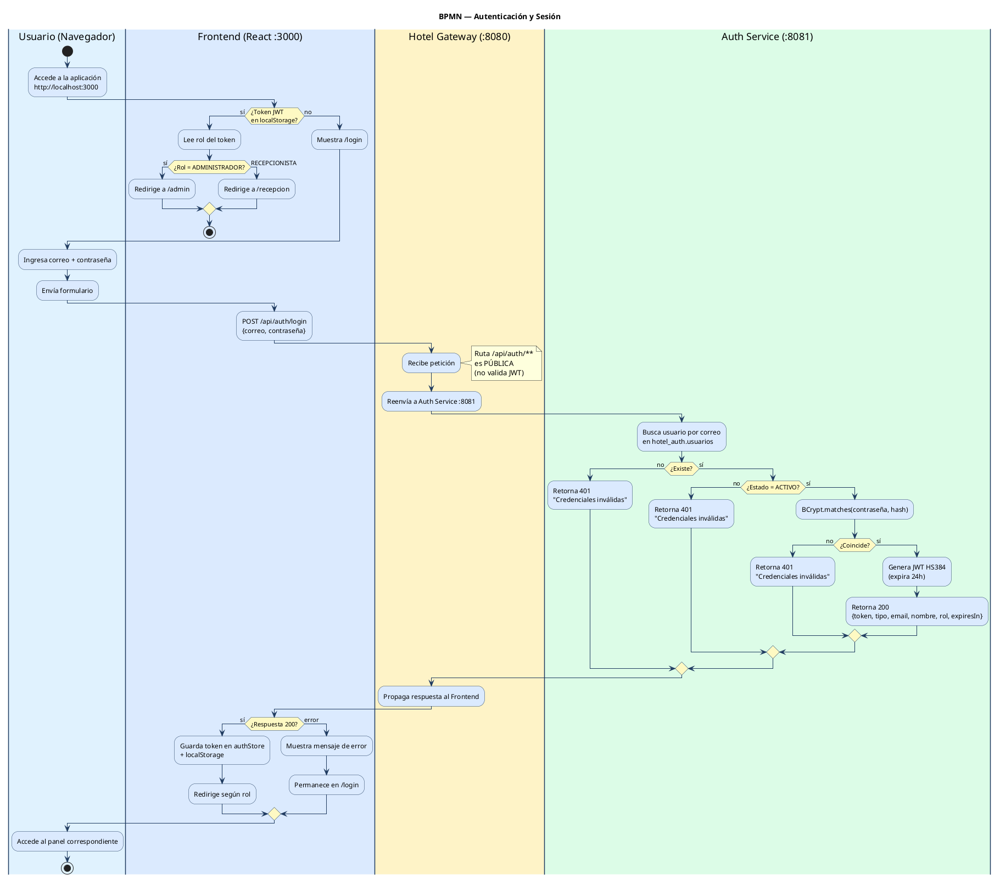
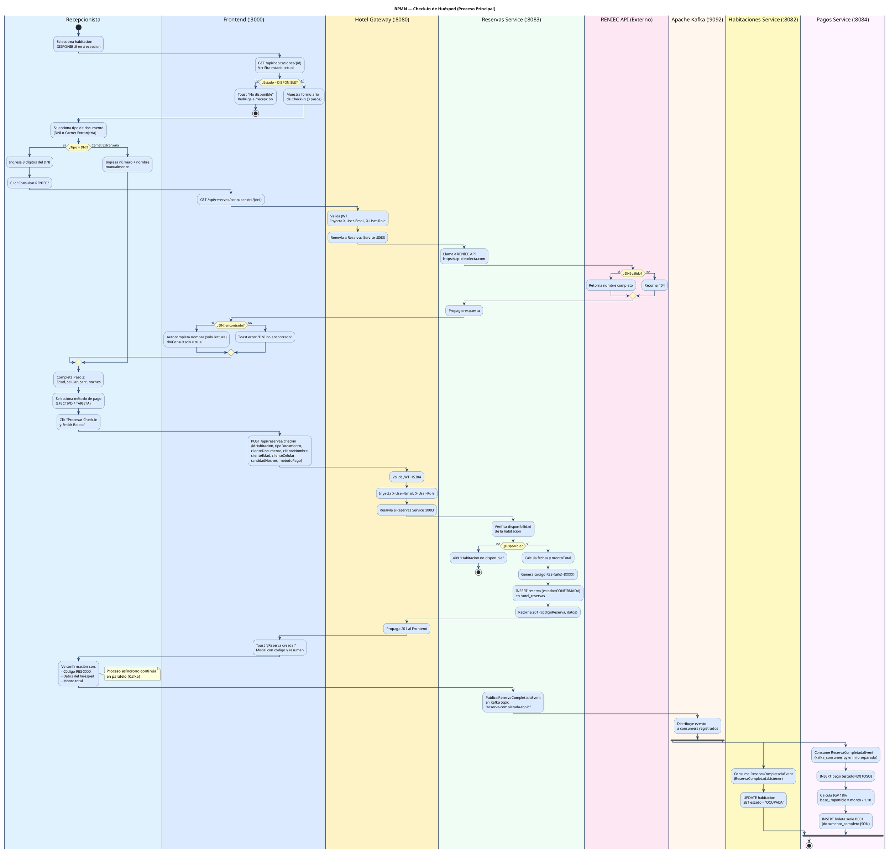
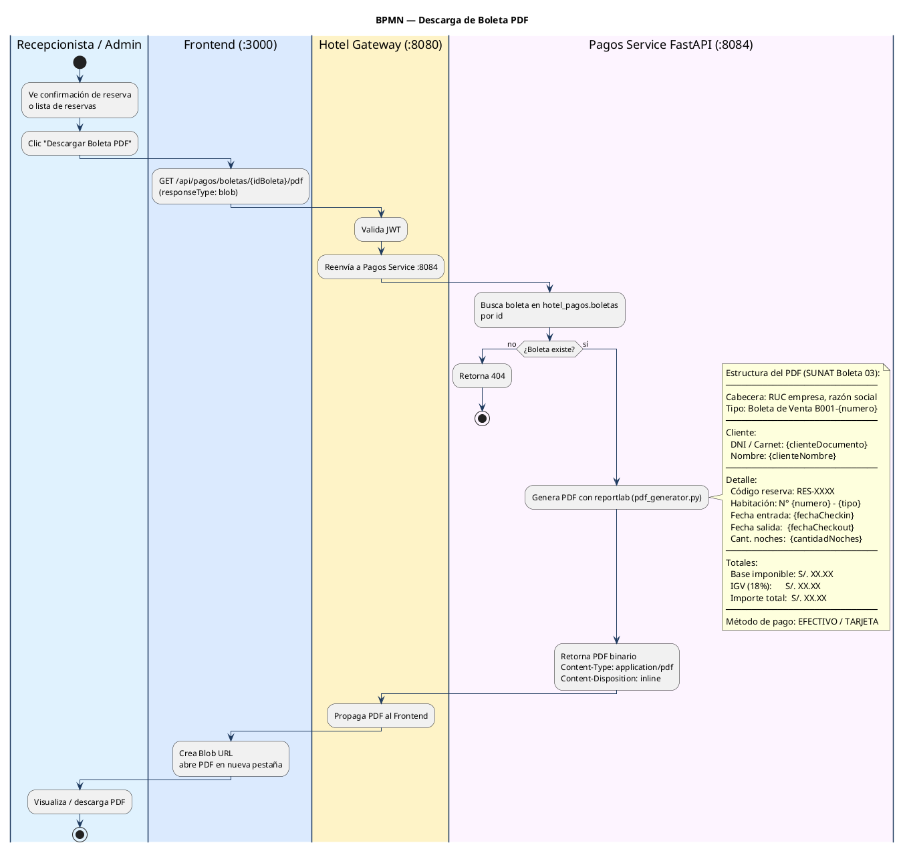
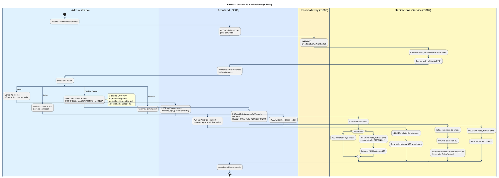
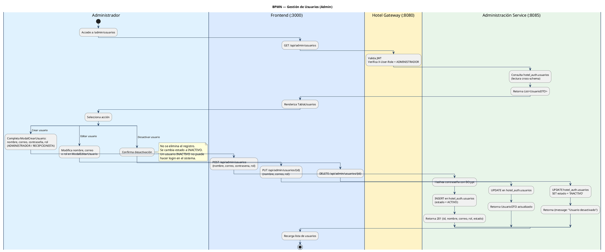
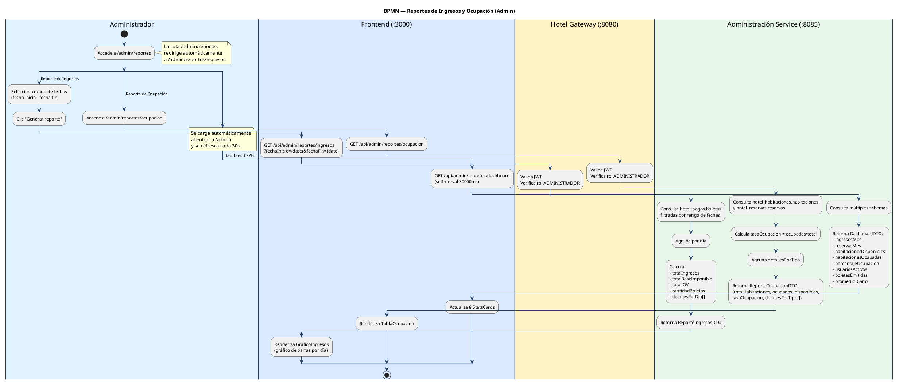
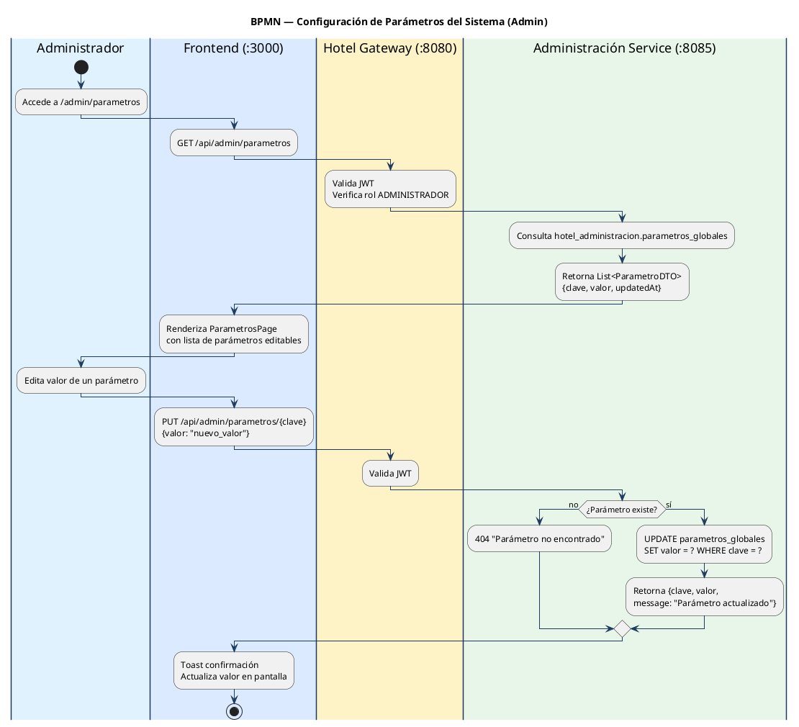
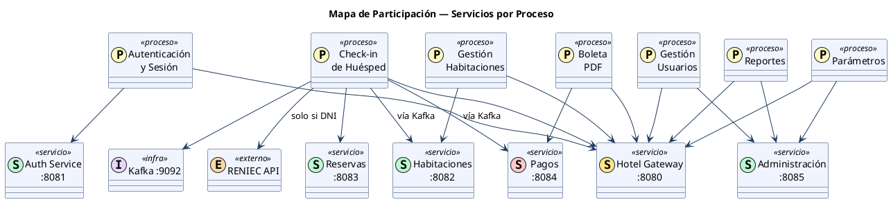

# Diagramas BPMN — Hotel BonAventura

Diagramas de proceso de negocio (estilo BPMN con swimlanes) que evidencian
qué actores y servicios participan en cada proceso del sistema.

---

## Tabla de Contenidos

1. [Proceso: Autenticación y Sesión](#1-proceso-autenticación-y-sesión)
2. [Proceso: Check-in de Huésped](#2-proceso-check-in-de-huésped)
3. [Proceso: Descarga de Boleta PDF](#3-proceso-descarga-de-boleta-pdf)
4. [Proceso: Gestión de Habitaciones](#4-proceso-gestión-de-habitaciones)
5. [Proceso: Gestión de Usuarios](#5-proceso-gestión-de-usuarios)
6. [Proceso: Generación de Reportes](#6-proceso-generación-de-reportes)
7. [Proceso: Configuración de Parámetros](#7-proceso-configuración-de-parámetros)
8. [Mapa de Participación de Servicios](#8-mapa-de-participación-de-servicios)

---

## 1. Proceso: Autenticación y Sesión

**Servicios involucrados:** Frontend · Hotel Gateway · Auth Service · Supabase

---

## 2. Proceso: Check-in de Huésped

**Servicios involucrados:** Frontend · Hotel Gateway · Reservas Service · Habitaciones Service · Pagos Service · RENIEC API · Kafka · Supabase

---

## 3. Proceso: Descarga de Boleta PDF

**Servicios involucrados:** Frontend · Hotel Gateway · Pagos Service · Supabase

---

## 4. Proceso: Gestión de Habitaciones

**Servicios involucrados:** Frontend · Hotel Gateway · Habitaciones Service · Supabase

---

## 5. Proceso: Gestión de Usuarios

**Servicios involucrados:** Frontend · Hotel Gateway · Administración Service · Supabase

---

## 6. Proceso: Generación de Reportes

**Servicios involucrados:** Frontend · Hotel Gateway · Administración Service · Supabase

---

## 7. Proceso: Configuración de Parámetros

**Servicios involucrados:** Frontend · Hotel Gateway · Administración Service · Supabase

---

## 8. Mapa de Participación de Servicios

Resumen de qué servicio participa en cada proceso de negocio.

