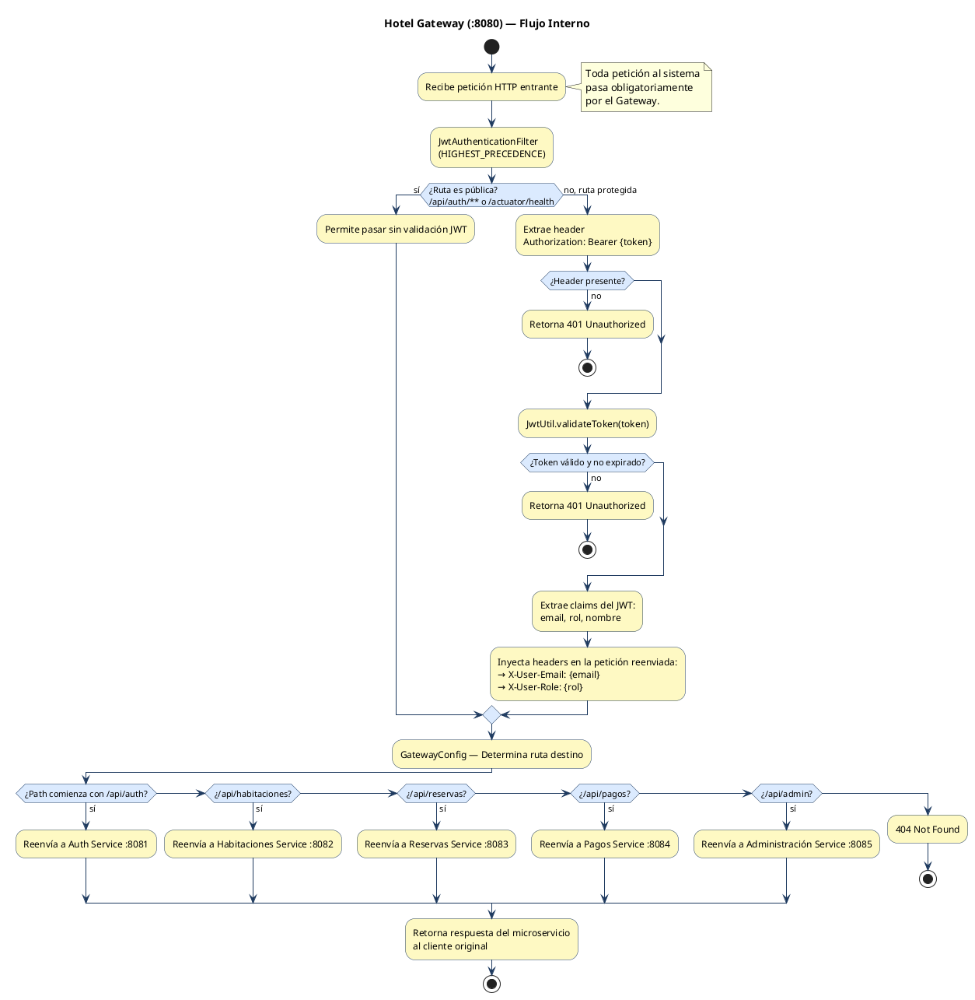
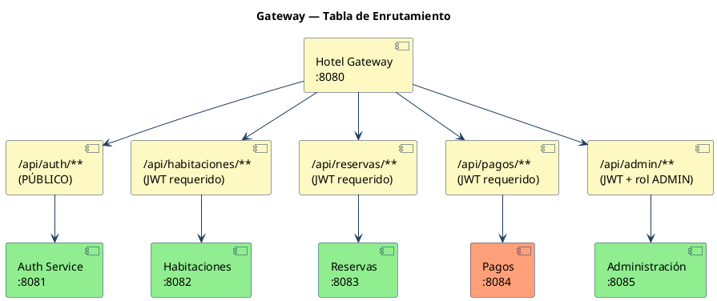
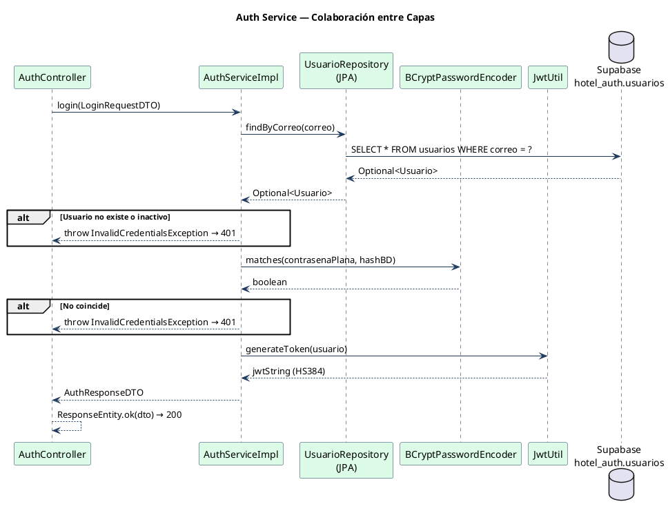
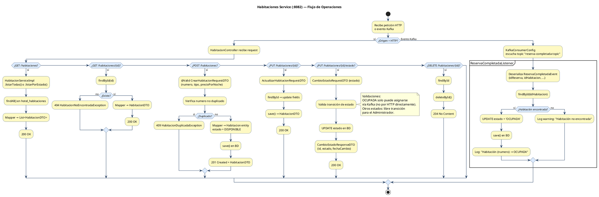
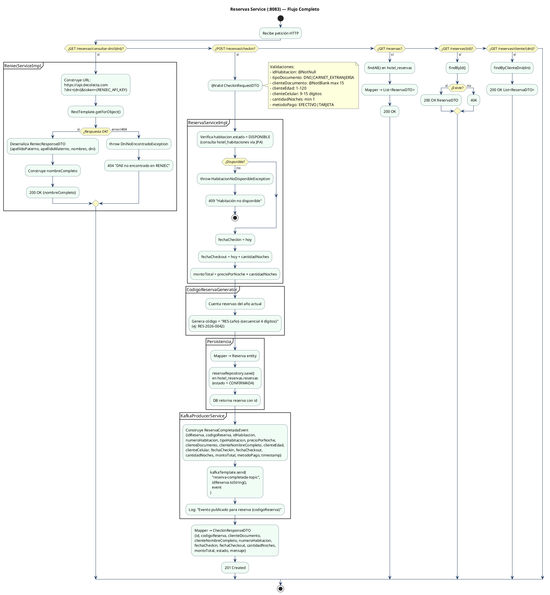
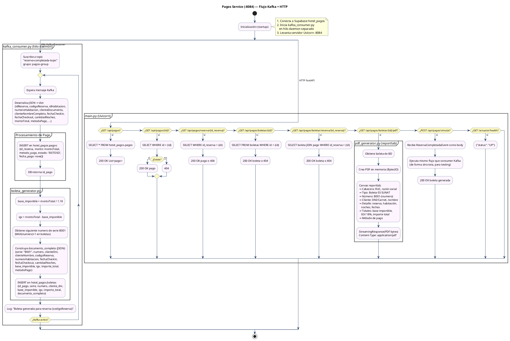
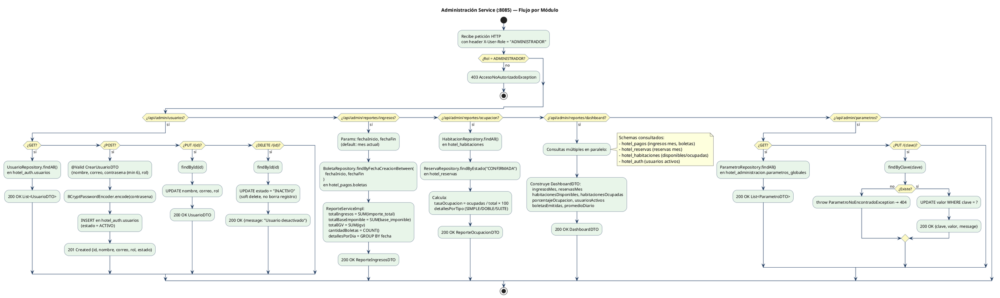
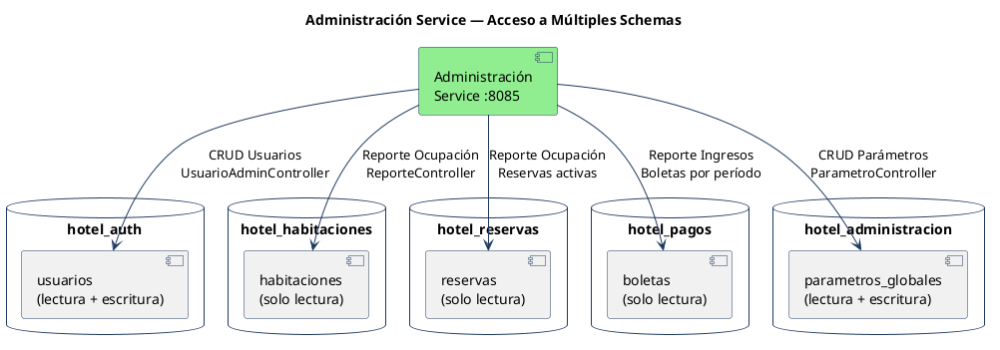

# Diagramas de Servicios — Hotel BonAventura

Diagramas de flujo interno para cada microservicio: qué recibe, cómo lo procesa,
con qué colabora y qué devuelve.

---

## Tabla de Contenidos

1. [Hotel Gateway — Enrutamiento y Seguridad](#1-hotel-gateway--enrutamiento-y-seguridad)
2. [Auth Service — Autenticación JWT](#2-auth-service--autenticación-jwt)
3. [Habitaciones Service — CRUD y Kafka Consumer](#3-habitaciones-service--crud-y-kafka-consumer)
4. [Reservas Service — Check-in, RENIEC y Kafka Producer](#4-reservas-service--check-in-reniec-y-kafka-producer)
5. [Pagos Service — Procesamiento y Boletas PDF](#5-pagos-service--procesamiento-y-boletas-pdf)
6. [Administración Service — Reportes, Usuarios y Parámetros](#6-administración-service--reportes-usuarios-y-parámetros)

---

## 1. Hotel Gateway — Enrutamiento y Seguridad

**Puerto:** 8080 | **Stack:** Spring Cloud Gateway (WebFlux reactivo)
**Responsabilidad:** Punto de entrada único. Valida JWT, inyecta contexto de usuario y enruta al microservicio correspondiente.



### Configuración de Rutas



---

## 2. Auth Service — Autenticación JWT

**Puerto:** 8081 | **Stack:** Spring Boot + Spring Security + JJWT
**Responsabilidad:** Único punto de autenticación. Valida credenciales y emite tokens JWT firmados con HS384.

```plantuml
@startuml servicio_auth
skinparam backgroundColor white
skinparam ArrowColor #1e3a5f
skinparam ActivityBorderColor #1e3a5f
skinparam ActivityBackgroundColor #dcfce7
skinparam ActivityDiamondBackgroundColor #fef9c3
skinparam SequenceArrowColor #1e3a5f

title Auth Service (:8081) — Flujo de Login

start

:POST /api/auth/login\n{correo, contrasena};

partition "AuthController" {
  :@Valid valida LoginRequestDTO;\n(correo: @Email @NotBlank\ncontrasena: @NotBlank)
  if (¿Pasa validación?) then (no)
    :400 Bad Request\n{timestamp, status, error, message, path};
    stop
  endif
}

partition "AuthServiceImpl" {
  :usuarioRepository\n.findByCorreo(correo);

  if (¿Usuario encontrado?) then (no)
    :throw InvalidCredentialsException;
  endif

  if (¿estado = "ACTIVO"?) then (no)
    :throw InvalidCredentialsException;
  endif

  :BCryptPasswordEncoder\n.matches(contrasena, usuario.contrasena);

  if (¿Hash coincide?) then (no)
    :throw InvalidCredentialsException;
  endif
}

partition "JwtUtil" {
  :Construye claims:\n{sub: correo, nombre, rol, iat, exp};
  :Firma con HMAC-SHA384\n(clave ≥ 48 bytes → HS384);
  :Genera token JWT;
}

partition "AuthController (respuesta)" {
  :Retorna 200 OK\n{token, tipo: "Bearer",\nemail, nombre, rol, expiresIn: 86400000};
}

stop

@enduml
```

### Capas Internas



---

## 3. Habitaciones Service — CRUD y Kafka Consumer

**Puerto:** 8082 | **Stack:** Spring Boot + Spring Data JPA + Spring Kafka
**Responsabilidad:** Gestión del catálogo y estado de habitaciones. Escucha eventos Kafka para actualizar estado automáticamente tras check-in.



---

## 4. Reservas Service — Check-in, RENIEC y Kafka Producer

**Puerto:** 8083 | **Stack:** Spring Boot + Spring Data JPA + Spring Kafka + RestTemplate
**Responsabilidad:** Proceso central de check-in. Consulta RENIEC, crea la reserva y publica el evento que desencadena los procesos de pago y estado de habitación.



---

## 5. Pagos Service — Procesamiento y Boletas PDF

**Puerto:** 8084 | **Stack:** FastAPI (Python) + Uvicorn + psycopg2 + kafka-python-ng + reportlab
**Responsabilidad:** Recibe eventos Kafka de reservas confirmadas, genera pagos y boletas electrónicas SUNAT tipo 03. Expone descarga de PDF.



---

## 6. Administración Service — Reportes, Usuarios y Parámetros

**Puerto:** 8085 | **Stack:** Spring Boot + Spring Security + Spring Data JPA
**Responsabilidad:** Panel administrativo completo. Lee datos de múltiples schemas para reportes cruzados. Gestiona usuarios y parámetros del sistema.



### Acceso Cross-Schema del Administración Service


