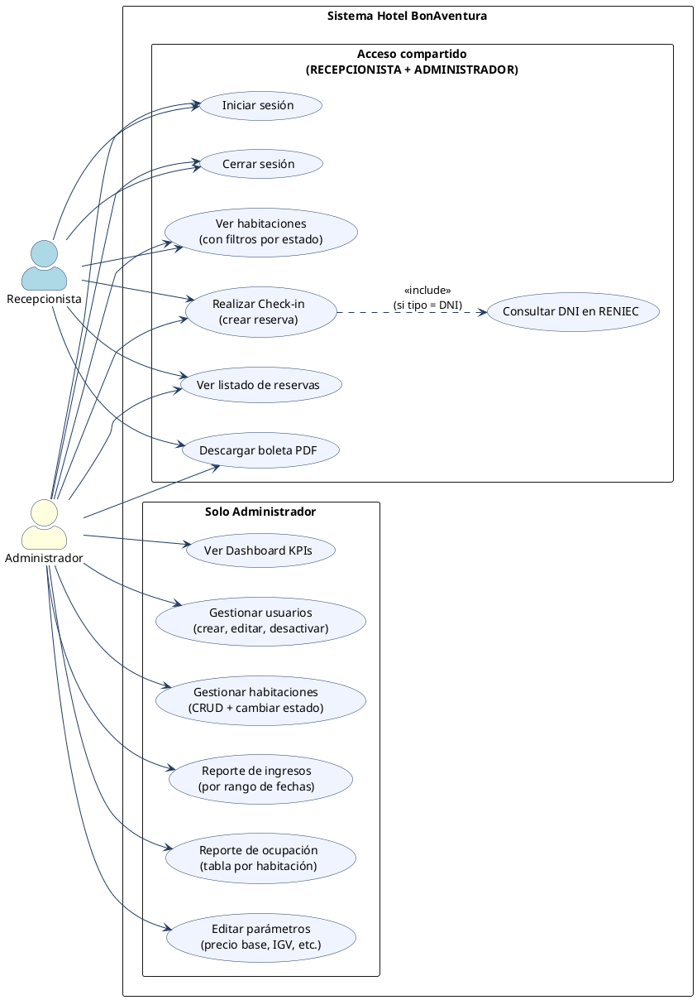
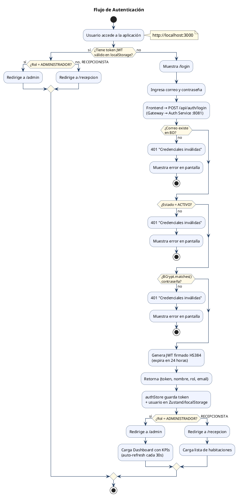
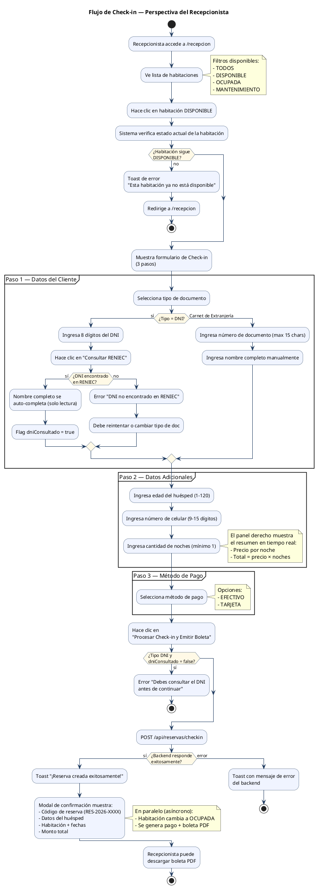
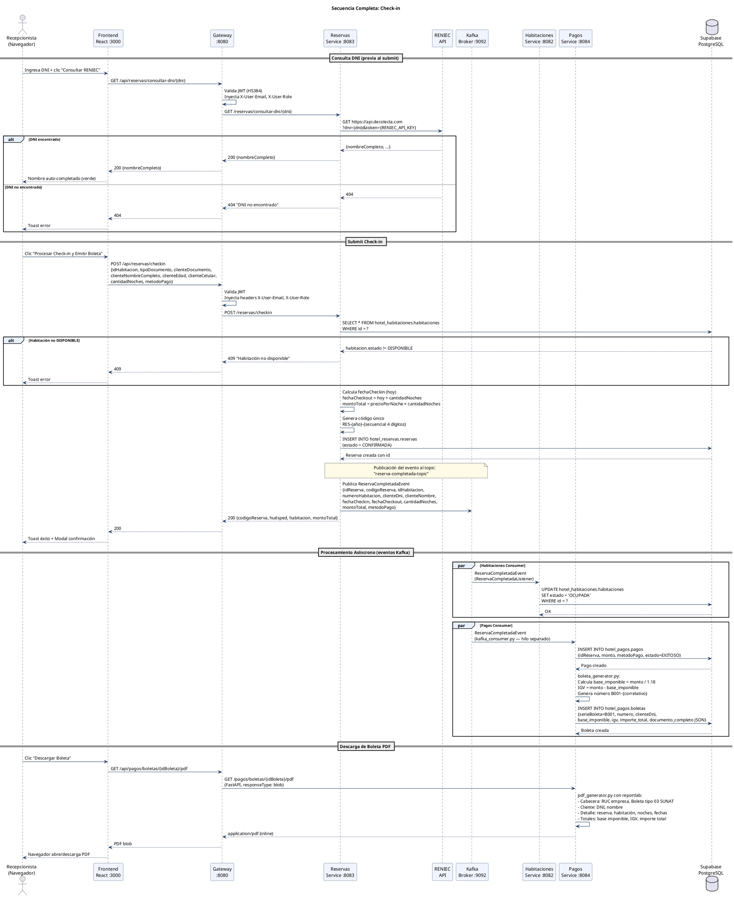
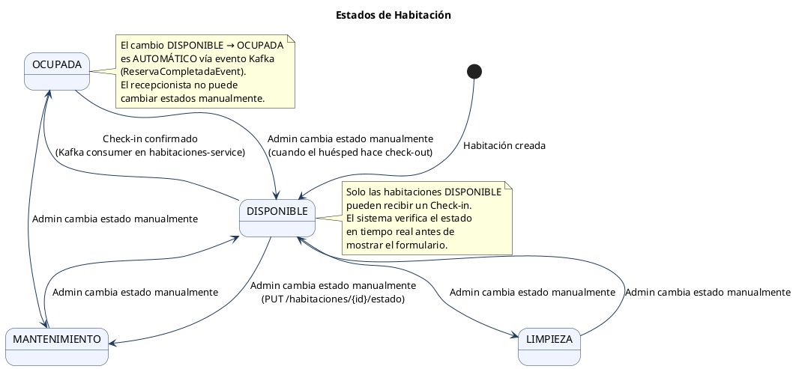
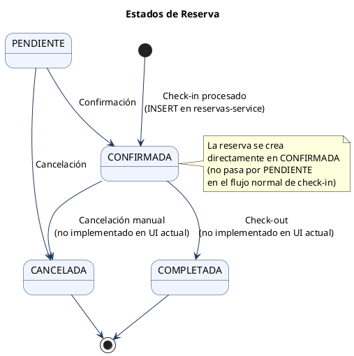
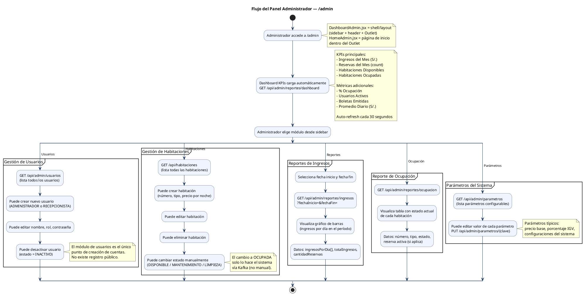
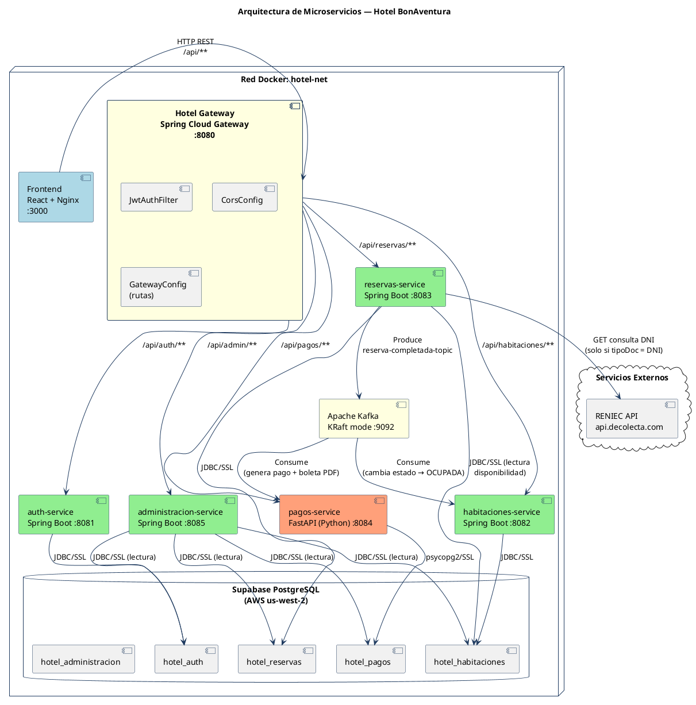

# Proceso de Negocio — Hotel BonAventura

Documento que describe los procesos operativos del sistema, los actores involucrados,
los flujos de cada caso de uso y los estados de las entidades principales.

---

## Tabla de Contenidos

1. [Roles del Sistema](#1-roles-del-sistema)
2. [Diagrama de Casos de Uso](#2-diagrama-de-casos-de-uso)
3. [Flujo de Autenticación](#3-flujo-de-autenticación)
4. [Flujo de Check-in (Recepcionista)](#4-flujo-de-check-in-recepcionista)
5. [Flujo Check-in — Secuencia Backend Completa](#5-flujo-check-in--secuencia-backend-completa)
6. [Estados de Habitación](#6-estados-de-habitación)
7. [Estados de Reserva](#7-estados-de-reserva)
8. [Flujo del Panel Administrador](#8-flujo-del-panel-administrador)
9. [Arquitectura de Servicios](#9-arquitectura-de-servicios)

---

## 1. Roles del Sistema

El sistema tiene **dos roles diferenciados**. El Administrador hereda todas las
capacidades del Recepcionista más las funciones de gestión y reportes.

| Rol | Acceso | Ruta base |
|---|---|---|
| `RECEPCIONISTA` | Habitaciones, Check-in, Reservas | `/recepcion` |
| `ADMINISTRADOR` | Todo lo anterior + Usuarios, Habitaciones (CRUD), Reportes, Parámetros | `/recepcion` y `/admin` |

> Un Recepcionista que intente acceder a `/admin` es redirigido automáticamente a `/recepcion`
> por `ProtectedRoute.jsx`.

---

## 2. Diagrama de Casos de Uso

---

## 3. Flujo de Autenticación

---

## 4. Flujo de Check-in (Recepcionista)

Este es el proceso operativo central del sistema. Involucra 3 pasos en el formulario
y desencadena eventos asíncronos en el backend.

---

## 5. Flujo Check-in — Secuencia Backend Completa

---

## 6. Estados de Habitación

---

## 7. Estados de Reserva

---

## 8. Flujo del Panel Administrador

---

## 9. Arquitectura de Servicios

---

## Notas de Implementación

### Aclaración: DashboardAdmin vs HomeAdmin

| Archivo | Tipo | Rol en la UI |
|---|---|---|
| `DashboardAdmin.jsx` | Layout/Shell | Sidebar de navegación + header "Administrador" + `<Outlet />`. Se renderiza en `/admin` y todas sus sub-rutas. |
| `HomeAdmin.jsx` | Página de contenido | KPIs y métricas del hotel. Se renderiza **dentro** del Outlet en la ruta `/admin` (index). Auto-refresh cada 30 segundos. |
| `DashboardRecepcion.jsx` | Layout/Shell | Mismo patrón: sidebar "Habitaciones / Reservas" + header "Recepcionista" + `<Outlet />`. |

### Reglas de Negocio Clave

1. **Check-in con DNI:** El recepcionista **debe** consultar RENIEC antes de poder enviar el formulario. El nombre se bloquea como solo lectura tras la consulta exitosa.
2. **Check-in con Carnet de Extranjería:** No pasa por RENIEC; el nombre se ingresa manualmente.
3. **Habitación OCUPADA:** El cambio de estado `DISPONIBLE → OCUPADA` es **exclusivamente automático** vía evento Kafka. Ni el recepcionista ni el administrador pueden forzarlo directamente.
4. **Boleta electrónica:** Se genera automáticamente con cada reserva confirmada. Sigue el formato SUNAT Boleta tipo 03 (serie B001 con correlativo).
5. **Creación de usuarios:** Solo el Administrador puede crear cuentas. No hay registro público.
6. **Expiración de sesión:** El JWT expira en 24 horas. El interceptor de Axios redirige automáticamente a `/login` ante cualquier `401`.
